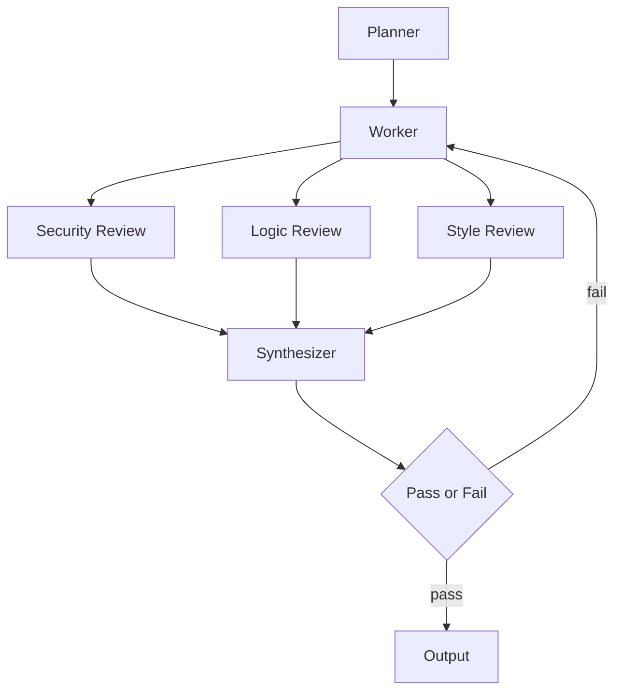

# Feature graph

Planner → Worker → **Security + Logic + Style in parallel** → Synthesizer → Gate → Output.

If the gate **fails**, the dashed loop returns to the Worker with synthesizer notes. Max **2** revision passes per run, then fail closed with a punch list.

## Nodes

| Node | File | Job |
|------|------|-----|
| Planner | `planner.md` | Scope the run, name features to inspect, set pass criteria |
| Worker | `worker.md` + `features.md` | Inventory each feature: need / built / working, with file evidence |
| Security Review | `security-review.md` | Privacy, auth, capture gates, secrets, localhost exposure |
| Logic Review | `logic-review.md` | Correctness vs intended behavior; moot vs needed; broken paths |
| Style Review | `style-review.md` | Widget-first UX, one-click law, copy, dead UI, personal (not SaaS) tone |
| Synthesizer | `synthesizer.md` | One row per feature; resolve conflicts; recommend KEEP / FIX / CUT / MISSING |
| Gate | `gate.md` | Pass only if every **needed** feature is KEEP or an explicit FIX with owner + next action |
| Output | `output.md` | The guide: what the personal desktop agent is, what to keep, what to cut, what to fix |

## Parallel reviews

The three reviews **must not wait on each other**. They read `NORTH-STAR.md`, `planner.md`, `worker.md`, and `features.md`, then write only their own file.

## Logging law

Each agent **appends** to its markdown file on every run:

- **What** they did
- **Why** they did it
- **Evidence** (paths, symbols)
- **Verdicts** that belong to their lens

Do not overwrite prior runs — add a new `## Run …` section at the top of the Log (newest first).
