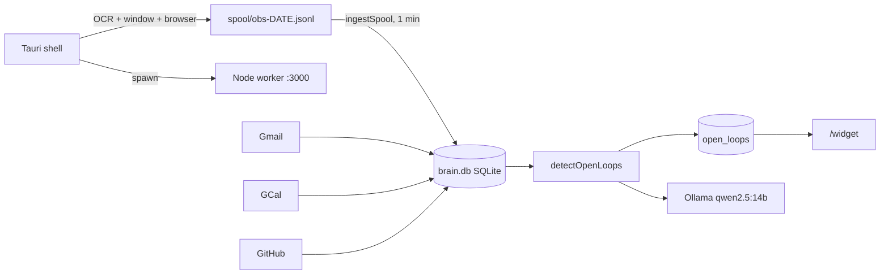

# Second Brain — Product & Architecture Audit

Living document. Records what works, what is broken, and why, so we can track progress
toward a sellable multi-user product.

- Created: 2026-08-12
- Scope: full pipeline audit (capture -> ingest -> detect -> rank -> UI)
- Status: diagnosis complete, remediation not started

---

## 1. What the product is today

A single-user, local-first Windows desktop app. Tauri shell spawns a Node worker
(`packages/worker`) that serves an API and a Vite SPA on `127.0.0.1:3000`. The floating
widget at `/widget` is the primary surface.



The single work unit is the **open loop** (`open_loops` table): a detected unfinished
commitment with a `kind`, a `confidence`, and a `status`.

---

## 2. What genuinely works

These are real assets and should not be rewritten.

- **The desktop lifecycle.** `apps/desktop/src-tauri/src/main.rs` + `core.rs` spawn and
  supervise the Node core, health-check it, own the tray, and load the widget directly.
  The one-click product law is actually satisfied. This is the hardest part of a local
  app and it is done.
- **The capture engine.** `apps/desktop/src-tauri/src/capture.rs` does foreground window
  tracking, Chrome/Edge history reads, and Windows OCR with adaptive intervals (2s on
  chat/trading surfaces, 8s otherwise) and an idle gate. Privacy blocklists for password
  managers, auth domains, and incognito titles are real and enforced in Rust.
- **The wake path.** Hot OCR debounce-posts to `/api/capture/wake`, which triggers a fast
  detect ~4s later. Sub-10-second reaction to something on screen is a genuine
  differentiator that cloud tools cannot match.
- **Ingest hygiene on connectors.** `packages/connectors/src/base.ts` has proper
  `raw_events` + `items` separation, content-hash change detection, and unique
  `(source_id, external_id)`. Gmail uses `historyId`, GCal uses `syncToken`, GitHub uses
  ETags. Incremental sync is correctly implemented.
- **The evidence trail.** `loop_evidence` linking loops back to the observation or item
  that created them is the right data model and is what will make explanations and
  learning possible later.
- **Local-only privacy posture.** Ollama on `127.0.0.1:11434`, encrypted `secrets.enc.json`,
  OCR text purged after 30 days. This is a real market position.

---

## 3. Root cause analysis: why the false positives happen

There is one dominant cause and several amplifiers. Fixing the amplifiers without fixing
the dominant cause will not move the numbers.

### 3.1 Dominant cause: the detector reads a screenshot blob, not messages

`scoreChatAction` in `packages/agents/src/chat-actions.ts` receives one field: `text` —
the entire OCR dump of the chat window, up to 12,000 characters. It then runs six
independent regex families over that whole blob and **adds** their weights:

```126:158:packages/agents/src/chat-actions.ts
  if (CHAT_ASK_RE.test(text)) {
    score += 0.55;
    reasons.push("ask");
  }
  if (CHAT_AWAIT_RE.test(text)) {
    score += 0.45;
    reasons.push("awaiting");
  }
  if (CHAT_PROMISE_RE.test(text)) {
    score += 0.4;
    reasons.push("promise");
  }
  if (CHAT_DEADLINE_RE.test(text)) {
    score += 0.5;
    reasons.push("deadline");
  }
```

A WhatsApp window showing 40 messages plus a sidebar of 20 other conversations will
almost certainly contain "can you" somewhere, "let me know" somewhere else, and "I'll"
in a third place — from three different people, on three different days, in three
different conversations. The score saturates at 1.0. Confidence becomes 0.95.

That is above `L1_ACCEPT = 0.7`, so the candidate is **accepted with no LLM verification
at all**:

```385:398:packages/agents/src/loops.ts
  const high = candidates.filter((c) =>
    fast ? c.confidence >= FAST_ACCEPT : c.confidence >= L1_ACCEPT,
  );
```

The LLM sanity check (`structureCandidates`, which is the only thing that can say
`keep: false`) only ever sees the **0.45–0.69 ambiguous band**. The loudest, most
confident garbage bypasses the only quality gate in the system. This is inverted: high
confidence from a saturating additive score is *less* trustworthy than a mid score, not
more.

### 3.2 Four structural gaps that make 3.1 unfixable by tuning

These are missing concepts, not bad thresholds. No amount of regex tuning fixes them.

- **No message boundaries.** The pipeline cannot tell where one message ends and the next
  begins. It matches across message boundaries.
- **No sender attribution or direction.** Nothing knows whether "I'll send it tonight"
  was typed by the user or received from someone else. Both create the same loop.
  `guessChatWho` takes the first plausible OCR line, which in WhatsApp Desktop is often
  the search box or an unrelated sidebar contact.
- **No message timestamp.** `observations.ts` is the OCR time, not the message time. A
  three-week-old message still visible on screen produces a brand-new loop today, every
  time the user opens that chat. The `sinceMinutes: 20` window in fast mode filters
  *observations*, not *messages*, so it does nothing to stop this.
- **No conversation identity.** `artifacts.kind = "thread"` is declared in the schema and
  never written. There is no conversation, participant, or message table anywhere.

Net effect: the system re-derives the same stale asks from a screenshot every few
seconds, with no way to know they are stale, already answered, or not addressed to the
user.

### 3.3 Amplifier: dedupe merges different things and splits identical things

`findSimilarOpenLoop` merges when `titleSim >= 0.55`, where `titleSim` is token-set
overlap over the *generated template titles*. Those titles are highly templated
("Reply to X on chat", "Follow up with X"):

- `Reply to Farhan on chat` vs `Reply to Raj on chat` -> tokens `{reply, farhan, chat}`
  vs `{reply, raj, chat}` -> 2/3 = **0.67 -> merged**. Two different people's asks
  collapse into one loop, and one of them is silently lost.
- Meanwhile the LLM rewrites titles freely in the ambiguous path, so the *same* real
  commitment phrased two ways stays two loops.

Both failure modes are active at once. The dedupe key is the wrong thing: it should key
on conversation + message identity, not on a rendered English sentence.

### 3.4 Amplifier: auto-close is far too loose, so real work disappears

`autoCloseLoops` closes a loop when **two** title tokens longer than three characters
appear anywhere in a recent item or observation, and a close-word appears anywhere in the
same body:

```594:595:packages/agents/src/loops.ts
    const closePatterns =
      /\b(done|merged|shipped|sent|resolved|closed|completed|fixed|replied|thanks|no longer needed|position closed|flattened|tp hit|sl hit|stopped out)\b/i;
```

`thanks` and `sent` are in that list, and the body being scanned is again a 12k-char OCR
blob. Any chat containing "thanks" plus two coincidental token matches silently closes a
real commitment with `closeReason: "auto_evidence"`. **False negatives are as damaging as
false positives here and are currently invisible** — the user never learns what was
closed out from under them.

### 3.5 Amplifier: confidence is being used as priority

The widget computes urgency from detector confidence:

```115:118:apps/web/src/pages/WidgetPage.tsx
    loop.kind === "awaiting_reply" ||
    (loop.confidence ?? 0) >= 0.75 ||
    !!loop.dueHint
```

Detector certainty ("I am sure this is a commitment") and user urgency ("this is due
today") are different axes. Conflating them means a very-certain trivial item outranks a
genuinely urgent one. This is why the ordering feels wrong even when the items are real.

There is also **no real time model**: `open_loops.due_hint` is a free-text string the LLM
invents. It is `Date.parse`d in exactly one defensive branch and otherwise rendered raw.
There is no `due_at` timestamp column, so "Urgent" and "Today" cannot be computed
correctly even in principle.

### 3.6 Amplifier: the feedback loop is write-only and does not generalize

- Spam / Not-tracking derive brittle literal rules into `user_spam_rules` and inject at
  most 40 of them as raw text into the prompt (`formatUserRulesForPrompt(40)`).
- `recordFeedback` in `packages/enrich/src/scoring.ts` is an explicit no-op.
- There is **no positive signal anywhere**. Nothing records that a suggestion was good,
  so nothing can learn what to surface — only an ever-growing blocklist of what to hide.
- Rules are literal, not semantic. Blocking one newsletter does not block its sibling.

### 3.7 Amplifier: the LLM gate is budget-starved and mis-targeted

`loop-budget.ts` allows 8 structure calls per run and 40 per day. The fast path — which
fires every few seconds while the user is in a chat app and is the single highest-volume
source of candidates — uses **no LLM at all**. So the highest-volume, lowest-quality path
is the least verified, and the low-volume path is rate-limited on top.

---

## 4. Blockers to selling this

Independent of quality, these prevent the app from being sold to anyone.

### 4.1 Security: unauthenticated API with wildcard CORS

`packages/worker/src/api.ts` sets `Access-Control-Allow-Origin: *` on every response and
has no authentication of any kind:

```74:81:packages/worker/src/api.ts
  const payload = JSON.stringify(body);
  res.writeHead(status, {
    "Content-Type": "application/json",
    "Access-Control-Allow-Origin": "*",
    "Access-Control-Allow-Methods": "GET,POST,PATCH,DELETE,OPTIONS",
    "Access-Control-Allow-Headers": "Content-Type",
```

Any website the user visits in any browser can `fetch("http://127.0.0.1:3000/api/loops")`
and read their entire second brain — emails, chats, OCR of their screen — and POST to
mutate it. This is a shipping blocker, not a hardening task.

### 4.2 Single-tenant by construction

There is no `user_id` column anywhere in the schema, no accounts, no onboarding, no
profile table. One SQLite file, one Google token, one GitHub token per machine.

### 4.3 Hardcoded to one person

| Location | Hardcoding |
|---|---|
| `packages/core/src/config.ts` | `tz: "Asia/Kolkata"` default |
| `apps/desktop/src-tauri/src/core.rs` | fallback repo path `~/OneDrive/Desktop/Personal/second-brain` |
| `packages/agents/src/chat-actions.ts` | large Hinglish regex block; UPI/NEFT; tax notice `142(1)` |
| `packages/agents/src/loops.ts` | prompt examples "Share the app with Farhan", "Set TP/SL on NVDA" |
| `packages/agents/src/trading-actions.ts` | an entire first-class scorer for crypto/trading desks |
| `apps/web/src/pages/WidgetPage.tsx` | dedicated "Trade" source filter |
| `packages/core/src/spam.ts` | personal newsletter names `scoop`, `muse`, `lineup is ready` in the **global** filter |
| `packages/core/src/db/seed.ts` | horizons hardcoded to Content / Dev / Startup |

The spam filter entry is actively harmful: "lineup is ready" will kill legitimate mail for
a sports fan or event planner. Trading has a dedicated scorer, a capture hot-path, a spam
allowlist, and a UI filter — it is a full vertical embedded in what is supposed to be a
horizontal product.

### 4.4 Distribution: the local model is a hard dependency

`qwen2.5:14b` for both fast and smart roles needs roughly 10GB of VRAM and a manual Ollama
install. Most buyers cannot run this. There is no hosted fallback and no smaller-model
path.

### 4.5 Correctness infrastructure: none

**Zero test files in the repo.** No `test` script. Every threshold in the system (0.5,
0.55, 0.7, 0.45, 0.88, 2 tokens) is an unvalidated guess, and there is no way to tell
whether a change improves or regresses precision. This is the deepest problem: without an
eval harness, all the fixes below are also guesses.

### 4.6 Scaling wall in the hot path

The pipeline loads whole tables into JS and filters in memory, on every run:

- `ingestSpool` builds a `Set` from **every** `observations.textHash` in the DB, every
  minute.
- `collectLoopCandidates` does `db.select().from(items).all()` then filters in JS.
- `autoCloseLoops` pulls all observations and all open loops.
- `findSimilarOpenLoop` is a linear scan per candidate, so detection is O(candidates x loops).

Fine at 10k rows, unusable at 1M. Indexes exist but are bypassed by `.all()`.

---

## 5. Gap analysis against the target product

> **Superseded 2026-08-12.** Chat was cut from the product. The target is now
> Urgent / Today / To-do / Improve yourself sourced from **Gmail, Calendar,
> GitHub, and browser history only**. The WhatsApp/Telegram/Slack rows below are
> kept as a record of why that call was made — all three are now removed, and
> chat windows are skipped at capture time rather than OCR'd.

Target (original): Urgent / Today / To-do / Improve yourself, sourced from Gmail, Calendar,
WhatsApp, Telegram, Slack, GitHub, and browser history.

| Requirement | Today | Gap |
|---|---|---|
| Gmail | Real API, incremental | Works |
| Calendar | Real API, `calendar_blocks` | Works |
| GitHub | Real API | Works |
| Browser history | Chrome + Edge only | No Firefox, Brave, Arc |
| ~~WhatsApp~~ | Removed | Cut from product |
| ~~Telegram~~ | Removed | Cut from product |
| ~~Slack~~ | Removed | Cut from product |
| Urgent bucket | `confidence >= 0.75` proxy | No `due_at`; wrong axis |
| Today bucket | "touched today" proxy | No real scheduling |
| To-do list | `open_loops` only | Legacy `tasks` table orphaned, no HTTP API |
| Improve yourself | Does not exist | No profile, no skill model; `brief.ts` has `const profile = null` |
| Reminders | Do not exist | No notification subsystem; snooze never wakes up |
| Per-user customization | Does not exist | `sources.enabled` in schema but never read |

Two smaller live bugs worth noting: `capture.toggles` is stored in the DB and never read
by the Rust engine, so the settings switches do nothing; and snoozed loops have no
expiry, so snooze is functionally the same as dismiss.

---

## 6. Verdict

The infrastructure is good and the product thesis is good. The intelligence layer is
where the value is claimed and it is the weakest part.

The core mistake is architectural, not parametric: **the system treats a screenshot as if
it were a message stream.** Everything downstream — scoring, dedupe, auto-close, ranking —
inherits that error and compounds it. Regex tuning cannot fix a missing data model.

Priority order for remediation:

1. Lock the API (auth + CORS). Blocks shipping to anyone.
2. Build an eval harness with labeled fixtures. Without it, nothing below is measurable.
3. Introduce a real message/conversation model and score per message, not per blob.
4. Split confidence from urgency; add a parsed `due_at`.
5. Rebuild dedupe on message identity instead of rendered titles.
6. Tighten auto-close and make it reversible and visible.
7. Add positive feedback and semantic (not literal) learned rules.
8. Extract the trading and Hinglish verticals behind per-user config.
9. Add `user_id` and an onboarding/profile flow.
10. Provide a hosted-model fallback.

---

## 7. Changelog

| Date | Change |
|---|---|
| 2026-08-12 | Initial audit. Diagnosis only, no code changes. |
| 2026-08-12 | Phase 0–4 remediation landed: API token auth + CORS allowlist; eval harness (`packages/evals`); `conversations`/`messages`/`reminders`/`insights`/`feedback_events`/`user_profiles`; Slack/Telegram/WhatsApp connectors (`packages/connectors-chat`); per-message loop detect (no L1 bypass); priority/`due_at` buckets Urgent/Today/To-do/Improve; snooze wake reminders; hosted LLM fallback; capture toggles wired; license/trial; de-hardcoded TZ/path/newsletter spam. |
| 2026-08-12 | **Chat removed — scope narrowed to mail / calendar / browsing history.** Deleted `packages/connectors-chat` (Slack OAuth + local session import, Telegram, WhatsApp), the widget Connections panel, the `/api/connections` and `/api/auth/{slack,telegram,whatsapp}` routes, the `chat` cron job, and the `conversations`/`messages` tables plus `open_loops.source_message_id`/`conversation_id`. Also dropped OCR chat-surface detection (`chat-actions.ts`) — capture now skips chat windows entirely rather than scoring them, removing a large false-positive source. Retired chat `sources` rows are cleaned up on seed. Product now targets four pillars: Today's todos, long-term reminders, upskill insights, and spam filtering. |
| 2026-08-12 | Mail-path quality fixes surfaced by the narrowed scope: HTML-only email is converted to text before storage (raw `<!doctype html>` markup was leaking into loop descriptions and LLM prompts), and the "open source" link label is derived from the URL rather than the item kind (Gmail mail classified as `notification` was labelled "Open on GitHub"). Fixed the stale project reference that made `@second-brain/connectors` fail `typecheck`; all nine workspaces now typecheck clean. |
| 2026-08-12 | **Fixed "Not Responding" blank window on launch.** `apps/desktop` `.setup()` called `ensure_core_running()` synchronously on the Tauri main thread, which blocks up to the health timeout while the core cold-starts (tsx compiles TS + loads native sqlite-vec, ~40s). The frozen main thread could not paint, so Windows marked the widget "Not Responding". Startup is now non-blocking: the window paints an instant loading screen, the core is brought up on a background thread, and the widget is navigated to (or a retry page shown) once healthy. Health cold-start headroom raised 45s→120s since the UI no longer waits on it. |
| 2026-08-12 | `/api/health` is public (no bearer token) so the desktop readiness probe cannot race the `api-token` file write on cold start. All other `/api/*` routes remain token-gated. Desktop shortcut refreshed to the fixed release exe. |
| 2026-08-13 | **Duplicate tasks from the same emails.** Loop detect created one task per Gmail *message* and only deduped on near-identical titles, so LLM rewrites (“update billing info” vs “Update billing information for Kling AI…”) and follow-ups in a thread (KOSH card) became separate cards. Detection now collapses items by Gmail/GitHub thread before the LLM, matches existing loops by thread / sender+topic / normalized titles, and merges already-open duplicates (8 merged on this install). |
| 2026-08-13 | Fresh local DB reset (`brain.db` + capture spool). Trading TP/SL tasks (ONDO `set_stop_loss` / `set tp/sl`) were coming from OCR because trading was **on by default** with an empty interest-packs list. Trading is now opt-in (`interests.trading=false`); capture ingest skips trading desks and TP/SL OCR so those cards cannot come back. Google credentials kept. |
| 2026-08-13 | **Categories + sent-mail.** Outbound mail (e.g. “Interested in engineering at Rivet”) was becoming a one-word **reply** task. Sent mail is never “reply”: job outreach is a **Follow up** (Career tag) or dropped if there is nothing to wait on. Each loop now has a `category` + tags (Follow up, Billing, Reply, Career, …) shown as chips instead of generic “Action”. |
